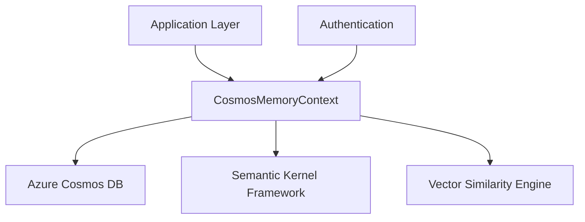

# CosmosDB Memory Management System - Requirements Document

## Executive Summary

The CosmosDB Memory Management System provides a unified, persistent memory solution for multi-agent automation engines. It combines traditional document storage with vector-based semantic search capabilities, enabling intelligent conversation management, plan persistence, and contextual memory retrieval across distributed agent sessions.

## 1. System Overview

### 1.1 Purpose
- **Primary Goal**: Provide persistent, scalable memory management for conversational AI and multi-agent systems
- **Secondary Goals**: 
  - Enable semantic search across historical conversations
  - Support cross-session context retention
  - Facilitate agent collaboration through shared memory stores

### 1.2 Key Capabilities
- Dual-mode operation: Traditional document storage + Vector similarity search
- Session-based data partitioning for multi-tenant environments
- Real-time message buffering with persistent backup
- Type-safe data model management with automatic serialization
- Integration with Microsoft Semantic Kernel framework

## 2. Functional Requirements

### 2.1 Core Memory Operations
| Requirement ID | Description | Priority |
|----------------|-------------|----------|
| FR-001 | Store and retrieve conversational messages with metadata | High |
| FR-002 | Persist planning data, steps, and execution states | High |
| FR-003 | Support vector embeddings for semantic similarity search | High |
| FR-004 | Maintain session-based data isolation | High |
| FR-005 | Provide real-time message buffering capabilities | Medium |

### 2.2 Data Model Support
| Entity Type | Storage Format | Key Fields |
|-------------|----------------|------------|
| ChatMessage | JSON Document | role, content, timestamp, session_id |
| Plan | JSON Document | goal, steps, status, created_at |
| PlanStep | JSON Document | description, status, parameters, order |
| MemoryRecord | JSON + Vector | text, embedding, metadata, collection |

### 2.3 Query and Retrieval
- **Text-based Queries**: Support SQL-like queries on document properties
- **Semantic Search**: K-nearest neighbor search using cosine similarity
- **Temporal Filtering**: Retrieve data within specified time ranges
- **Session Filtering**: Isolate data by session or user context

## 3. Technical Architecture

### 3.1 Storage Layer

- **Primary Database**: Azure Cosmos DB (NoSQL)
- **Partition Strategy**: Session-based partitioning for horizontal scaling
- **Consistency Model**: Eventual consistency with strong consistency options
- **Container Structure**: Single container with multiple document types

#### 3.1.1 Partitioning Strategy

**Primary Partition Key**: `session_id`

The partitioning strategy is designed to ensure optimal performance, scalability, and data locality for multi-agent conversational workloads.

**Partition Key Design Principles:**
- **Data Locality**: All conversation data for a session resides in the same logical partition
- **Query Efficiency**: Most queries are session-scoped, eliminating cross-partition queries
- **Load Distribution**: Sessions are naturally distributed across users/agents
- **Scalability**: New sessions automatically distribute across available partitions

**Partition Structure:**
```json
{
  "id": "unique-document-id",
  "session_id": "session-abc-123",  // Partition Key
  "type": "chatmessage|plan|planstep|memoryrecord",
  "timestamp": "2025-06-19T10:30:00Z",
  "data": { /* document-specific data */ }
}
```

**Partition Size Management:**
- **Target Size**: 10GB per logical partition (Cosmos DB limit: 20GB)
- **Document Count**: Approximately 100,000-500,000 documents per session
- **Monitoring**: Track partition size via Azure Monitor metrics
- **Mitigation**: Implement session archival for long-running sessions

**Hot Partition Prevention:**
- **Session Rotation**: Encourage new session creation for long conversations
- **Load Balancing**: Monitor RU consumption per partition key range
- **Throttling**: Implement client-side rate limiting for high-activity sessions
- **Scaling**: Automatic throughput scaling based on partition utilization

**Query Patterns and Partition Efficiency:**

| Query Type | Partition Efficiency | Example |
|------------|---------------------|---------|
| Single Session Messages | ✅ Optimal | `WHERE session_id = 'abc-123'` |
| Session-scoped Plans | ✅ Optimal | `WHERE session_id = 'abc-123' AND type = 'plan'` |
| Cross-session Search | ⚠️ Cross-partition | `WHERE content CONTAINS 'keyword'` |
| Time-range Queries | ⚠️ Cross-partition | `WHERE timestamp > '2025-06-01'` |
| User-based Queries | ❌ Full scan | `WHERE user_id = 'user-456'` |

**Alternative Partitioning Strategies Considered:**

1. **User-based Partitioning** (`user_id`)
   - ❌ Hot partitions for active users
   - ❌ Uneven distribution across user activity levels
   - ✅ Good for user-centric queries

2. **Time-based Partitioning** (`date`)
   - ❌ Sequential hot partitions
   - ❌ Poor query locality for conversations
   - ✅ Good for archival scenarios

3. **Hybrid Partitioning** (`user_id + date`)
   - ⚠️ Complex partition key management
   - ⚠️ Potential for small partitions
   - ✅ Better distribution than pure user-based

**Partition Key Evolution Strategy:**
- **Phase 1**: Session-based partitioning (current implementation)
- **Phase 2**: Consider hierarchical partitioning for large deployments
- **Phase 3**: Evaluate synthetic partition keys for extreme scale

**Data Distribution Examples:**
```
Partition: session-user1-20250619-001
├── ChatMessage: 245 documents (2.1 MB)
├── Plan: 12 documents (0.8 MB)
├── PlanStep: 89 documents (1.2 MB)
└── MemoryRecord: 156 documents (12.4 MB)
Total: 502 documents, 16.5 MB

Partition: session-user2-20250619-002
├── ChatMessage: 89 documents (0.9 MB)
├── Plan: 3 documents (0.2 MB)
├── PlanStep: 18 documents (0.3 MB)
└── MemoryRecord: 45 documents (3.8 MB)
Total: 155 documents, 5.2 MB
```

**Partition Monitoring and Alerting:**
- **Metrics**: Partition key range consumption, request unit usage
- **Alerts**: Partition approaching size limits (>15GB)
- **Actions**: Automated session archival, partition key rotation
- **Reporting**: Weekly partition health reports

### 3.2 Integration Points


### 3.3 Authentication & Security
- **Authentication**: Azure Default Credential (Managed Identity)
- **Authorization**: Role-based access control (RBAC)
- **Data Encryption**: Encryption at rest and in transit
- **Network Security**: Private endpoints support

## 4. Non-Functional Requirements

### 4.1 Performance Requirements
| Metric | Target | Measurement |
|--------|--------|-------------|
| Message Storage Latency | < 100ms | 95th percentile |
| Query Response Time | < 500ms | Average for up to 1000 records |
| Concurrent Sessions | 1000+ | Simultaneous active sessions |
| Vector Search Performance | < 2s | For collections up to 10,000 records |

### 4.2 Scalability Requirements
- **Data Volume**: Support up to 1TB of conversational data per deployment
- **Throughput**: Handle 10,000 operations per second across all sessions
- **Growth Pattern**: Linear scaling with additional Cosmos DB throughput units
- **Geographic Distribution**: Multi-region deployment capability

### 4.3 Reliability & Availability
- **Uptime Target**: 99.9% availability
- **Data Durability**: 99.999999999% (11 9's)
- **Backup Strategy**: Automated daily backups with 30-day retention
- **Disaster Recovery**: Cross-region replication with < 1 minute RPO

## 5. Data Management Policies

### 5.1 Data Lifecycle
1. **Creation**: Real-time ingestion during agent interactions
2. **Active Use**: Immediate availability for queries and similarity search
3. **Archival**: Move cold data to lower-cost storage after 90 days
4. **Deletion**: Automated cleanup based on retention policies

### 5.2 Data Retention
| Data Type | Retention Period | Archival Strategy |
|-----------|------------------|-------------------|
| Chat Messages | 1 year | Archive to blob storage |
| Plans & Steps | 2 years | Compress and archive |
| Vector Embeddings | 6 months | Delete after archival |
| System Metadata | 3 months | Automatic cleanup |

## 6. Integration Specifications

### 6.1 Semantic Kernel Integration
- Implements `MemoryStoreBase` interface for compatibility
- Supports semantic memory operations (store, recall, search)
- Compatible with existing SK plugins and planners

### 6.2 Application Integration
```python
# Example Usage Pattern
async with CosmosMemoryContext(config) as memory:
    # Store conversation
    await memory.add_message("user", "Hello", session_id)
    
    # Semantic search
    similar = await memory.get_nearest_matches("greeting", limit=5)
    
    # Query planning data
    plans = await memory.query_items("plan", {"status": "active"})
```

## 7. Deployment Requirements

### 7.1 Infrastructure Dependencies
- Azure Cosmos DB account with SQL API
- Azure Key Vault for connection string management
- Application Insights for monitoring and diagnostics
- Virtual Network for secure connectivity

### 7.2 Configuration Management
- Environment-specific connection strings
- Configurable throughput allocation (RU/s)
- Tunable consistency levels per operation
- Region-specific deployment parameters

## 8. Monitoring & Observability

### 8.1 Key Metrics
- **Operational**: Request latency, throughput utilization, error rates
- **Business**: Session activity, memory utilization, search effectiveness
- **Cost**: RU consumption, storage usage, cross-region transfer

### 8.2 Alerting Thresholds
| Metric | Warning | Critical |
|--------|---------|----------|
| Request Latency | > 1s | > 5s |
| Error Rate | > 1% | > 5% |
| RU Consumption | > 80% | > 95% |
| Storage Usage | > 70% | > 90% |

## 9. Security & Compliance

### 9.1 Data Protection
- Encryption of sensitive conversation data
- Tokenization of personally identifiable information (PII)
- Audit logging of all data access operations
- Regular security assessments and penetration testing

### 9.2 Compliance Considerations
- GDPR compliance for EU data subjects
- CCPA compliance for California residents
- Industry-specific requirements (HIPAA, SOX, etc.)
- Data residency requirements per jurisdiction

## 10. Success Criteria

### 10.1 Technical Success Metrics
- Zero data loss incidents over 12-month period
- < 0.1% of queries result in errors or timeouts
- System scales to handle 10x current load without architecture changes
- Vector search accuracy maintains > 85% relevance score

### 10.2 Business Success Metrics
- Improved agent response quality through contextual memory
- Reduced conversation restart frequency by 60%
- Enhanced user satisfaction scores in multi-turn conversations
- Successful cross-session context handoffs in 95% of cases

---

## Document Control

| Version | Date | Author | Changes |
|---------|------|--------|---------|
| 1.0 | 2025-06-19 | System Architect | Initial requirements document |

**Approval**: [Pending stakeholder review]
**Next Review**: [30 days from publication]
