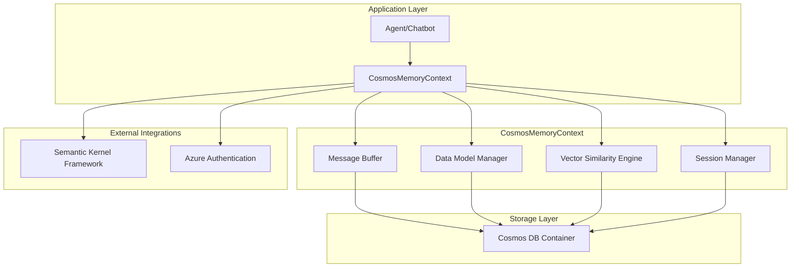

# CosmosMemoryContext: Technical Overview & Operation Guide

## Executive Summary

The `CosmosMemoryContext` is a sophisticated memory management system that acts as a bridge between conversational AI agents and Azure Cosmos DB. It serves three primary functions: **persistent conversation storage**, **semantic memory operations**, and **multi-session data management**. The system combines real-time message buffering with durable persistence, enabling agents to maintain context across sessions while supporting vector-based similarity searches for intelligent conversation retrieval.

**Key Capabilities in Brief:**
- 🗄️ **Dual Storage Model**: In-memory buffering + persistent Cosmos DB storage
- 🔍 **Semantic Search**: Vector similarity matching for contextual memory retrieval
- 🎯 **Session Isolation**: Partition-based data segregation for multi-tenant environments
- 🔄 **Type-Safe Operations**: Automatic serialization/deserialization of complex data models
- 🌐 **Framework Integration**: Native compatibility with Microsoft Semantic Kernel

---

## Core Architecture Overview



---

## Main Tasks and Operations

### 1. Initialization and Connection Management

**Purpose**: Establish and maintain connection to Azure Cosmos DB with proper authentication and container setup.

**How It Works:**
```python
async def initialize(self):
    # 1. Create Azure credentials using DefaultAzureCredential
    credential = DefaultAzureCredential()
    
    # 2. Initialize Cosmos client with endpoint and credentials
    self.cosmos_client = CosmosClient(
        url=self.cosmos_endpoint,
        credential=credential
    )
    
    # 3. Get or create database and container
    database = self.cosmos_client.get_database_client(self.database_name)
    self.container = database.get_container_client(self.container_name)
```

**Key Features:**
- **Lazy Initialization**: Connection only established when first needed
- **Azure Authentication**: Uses managed identity or service principal
- **Error Resilience**: Graceful handling of connection failures
- **Session Partitioning**: Container configured with `session_id` as partition key

### 2. Message Buffer Management

**Purpose**: Provide fast access to recent conversation messages while ensuring persistence.

**Data Flow:**
```python
# Adding a message
async def add_message(self, role: str, content: str, session_id: str):
    # 1. Create ChatMessage object
    message = ChatMessage(
        role=role,
        content=content,
        timestamp=datetime.now(timezone.utc),
        session_id=session_id
    )
    
    # 2. Add to in-memory buffer
    self.message_buffer.append(message)
    
    # 3. Persist to Cosmos DB
    await self.add_item(message)
    
    # 4. Maintain buffer size (keep last N messages)
    if len(self.message_buffer) > self.max_buffer_size:
        self.message_buffer.pop(0)
```

**Buffer Strategy:**
- **Dual Storage**: Messages exist in both memory and database
- **Size Management**: Configurable buffer size (default: 100 messages)
- **Session Filtering**: Buffer contains messages from current session
- **Performance**: Memory access for recent messages, DB for historical data

### 3. Data Model Operations (CRUD)

**Purpose**: Provide type-safe operations for storing and retrieving different data types (ChatMessage, Plan, PlanStep, MemoryRecord).

**Type Management System:**
```python
MODEL_CLASS_MAPPING = {
    "chatmessage": ChatMessage,
    "plan": Plan,
    "planstep": PlanStep,
    "memoryrecord": MemoryRecord
}

async def add_item(self, item: BaseModel) -> str:
    # 1. Convert Pydantic model to dictionary
    item_dict = item.model_dump()
    
    # 2. Handle datetime serialization
    item_dict = self._serialize_datetime_fields(item_dict)
    
    # 3. Add metadata
    item_dict.update({
        "id": str(uuid.uuid4()),
        "type": item.__class__.__name__.lower(),
        "session_id": getattr(item, 'session_id', self.session_id)
    })
    
    # 4. Store in Cosmos DB
    await self.container.create_item(item_dict)
```

**Query Operations:**
```python
async def query_items(self, item_type: str, filters: Dict = None) -> List[BaseModel]:
    # 1. Build SQL query with filters
    query = f"SELECT * FROM c WHERE c.type = '{item_type}'"
    if filters:
        for key, value in filters.items():
            query += f" AND c.{key} = '{value}'"
    
    # 2. Execute query with session partition
    items = self.container.query_items(
        query=query,
        partition_key=self.session_id
    )
    
    # 3. Deserialize to typed objects
    result = []
    for item in items:
        model_class = MODEL_CLASS_MAPPING[item_type]
        obj = model_class(**item)
        result.append(obj)
    
    return result
```

### 4. Vector Similarity Search (Semantic Memory)

**Purpose**: Enable semantic search across stored conversations and memory records using vector embeddings.

**Storage Process:**
```python
async def upsert_memory_record(self, record: MemoryRecord) -> str:
    # 1. Create document structure
    document = {
        "id": record.id or str(uuid.uuid4()),
        "type": "memoryrecord",
        "session_id": self.session_id,
        "key": record.key,
        "text": record.text,
        "embedding": record.embedding.tolist(),  # Convert numpy to list
        "metadata": record.metadata,
        "collection": record.collection
    }
    
    # 2. Store in Cosmos DB
    await self.container.upsert_item(document)
```

**Similarity Search Process:**
```python
async def get_nearest_matches(self, embedding: ndarray, limit: int = 5) -> List[Tuple[MemoryRecord, float]]:
    # 1. Retrieve all memory records
    query = "SELECT * FROM c WHERE c.type = 'memoryrecord'"
    stored_records = self.container.query_items(query)
    
    # 2. Calculate cosine similarity for each record
    similarities = []
    for record in stored_records:
        stored_embedding = np.array(record["embedding"])
        similarity = cosine_similarity(embedding, stored_embedding)
        similarities.append((record, similarity))
    
    # 3. Sort by similarity and return top matches
    similarities.sort(key=lambda x: x[1], reverse=True)
    return similarities[:limit]
```

**Similarity Calculation:**
```python
def cosine_similarity(vec1: ndarray, vec2: ndarray) -> float:
    # Handle zero vectors
    norm1, norm2 = np.linalg.norm(vec1), np.linalg.norm(vec2)
    if norm1 == 0 or norm2 == 0:
        return 0.0
    
    # Calculate cosine similarity
    return np.dot(vec1, vec2) / (norm1 * norm2)
```

### 5. Session Management and Data Isolation

**Purpose**: Ensure data separation between different conversation sessions and users.

**Session Lifecycle:**
```python
class CosmosMemoryContext:
    def __init__(self, config: CosmosMemoryConfig):
        # Session ID becomes partition key
        self.session_id = config.session_id
        self.message_buffer = []  # Session-specific buffer
    
    async def __aenter__(self):
        # Initialize connection when entering context
        await self.initialize()
        await self._load_recent_messages()  # Load session history
        return self
    
    async def __aexit__(self, exc_type, exc_val, exc_tb):
        # Cleanup when exiting context
        await self._persist_buffer()  # Ensure all data is saved
        self.cosmos_client = None
```

**Data Isolation Mechanisms:**
- **Partition Key**: All operations scoped to `session_id`
- **Query Filtering**: Automatic session filtering in all queries
- **Buffer Isolation**: Each session maintains separate message buffer
- **Cross-Session Prevention**: No accidental data leakage between sessions

---

## Integration Patterns

### Semantic Kernel Integration

```python
# The class implements MemoryStoreBase interface
class CosmosMemoryContext(MemoryStoreBase):
    # Standard SK memory operations
    async def get_collections(self) -> List[str]:
        # Return list of available memory collections
    
    async def create_collection(self, collection_name: str):
        # Create new memory collection
    
    async def get_nearest_matches(self, collection_name: str, embedding: ndarray, limit: int):
        # Semantic search implementation
```

### Application Usage Pattern

```python
# Typical usage in a conversational agent
async def handle_conversation(user_input: str, session_id: str):
    config = CosmosMemoryConfig(session_id=session_id)
    
    async with CosmosMemoryContext(config) as memory:
        # 1. Store user message
        await memory.add_message("user", user_input, session_id)
        
        # 2. Get conversation history
        recent_messages = memory.get_recent_messages(limit=10)
        
        # 3. Find similar past conversations
        if embedding_service:
            user_embedding = await embedding_service.embed(user_input)
            similar_memories = await memory.get_nearest_matches(
                user_embedding, limit=3
            )
        
        # 4. Generate response using context
        response = await agent.generate_response(
            current_input=user_input,
            history=recent_messages,
            context=similar_memories
        )
        
        # 5. Store agent response
        await memory.add_message("assistant", response, session_id)
        
        return response
```

---

## Performance Characteristics

### Latency Profile
| Operation | Typical Latency | Factors |
|-----------|----------------|---------|
| Add Message | 50-100ms | Network to Cosmos DB |
| Get Recent Messages | <10ms | In-memory buffer access |
| Query Historical Data | 100-500ms | Query complexity, data size |
| Similarity Search | 500ms-2s | Number of embeddings, vector size |
| Session Initialization | 200-800ms | Authentication, container setup |

### Scalability Considerations
- **Message Buffer**: O(1) for recent messages, configurable size limit
- **Similarity Search**: O(n) where n = number of stored embeddings
- **Partition Performance**: Optimal for session-scoped queries
- **Cross-Partition Queries**: Expensive for time-range or content searches

### Resource Usage
- **Memory**: ~1MB per 1000 messages in buffer
- **Storage**: Variable based on message content and embeddings
- **Network**: Frequent small requests to Cosmos DB
- **CPU**: Moderate for similarity calculations

---

## Error Handling and Resilience

### Connection Management
```python
async def ensure_initialized(self):
    if not self.container:
        try:
            await self.initialize()
        except Exception as e:
            logger.error(f"Failed to initialize Cosmos connection: {e}")
            raise CosmosConnectionError("Unable to connect to Cosmos DB") from e
```

### Operation Reliability
- **Retry Logic**: Automatic retry for transient failures
- **Graceful Degradation**: Continue with buffer-only mode if DB unavailable
- **Error Propagation**: Clear error messages with context
- **Logging**: Comprehensive logging for debugging and monitoring

### Data Consistency
- **Dual Write**: Messages written to both buffer and database
- **Eventual Consistency**: Cosmos DB consistency model
- **Conflict Resolution**: Last-writer-wins for concurrent updates
- **Backup Strategy**: Automatic Cosmos DB backups

---

## Best Practices and Optimization

### Performance Optimization
1. **Buffer Management**: Keep frequently accessed data in memory
2. **Query Optimization**: Use partition key in all queries
3. **Batch Operations**: Group multiple writes when possible
4. **Connection Pooling**: Reuse Cosmos client instances

### Data Management
1. **Partition Design**: Ensure even distribution across partition keys
2. **TTL Management**: Set time-to-live for old data
3. **Index Optimization**: Create indexes for frequently queried fields
4. **Compression**: Use efficient serialization for large objects

### Monitoring and Observability
1. **Metrics**: Track operation latencies, error rates, partition usage
2. **Logging**: Structured logging with correlation IDs
3. **Alerting**: Monitor for connection failures, high latencies
4. **Dashboards**: Real-time visibility into system health

This technical overview provides a comprehensive understanding of how the CosmosMemoryContext operates, from initialization through complex semantic search operations, enabling developers to effectively utilize and extend the system.
